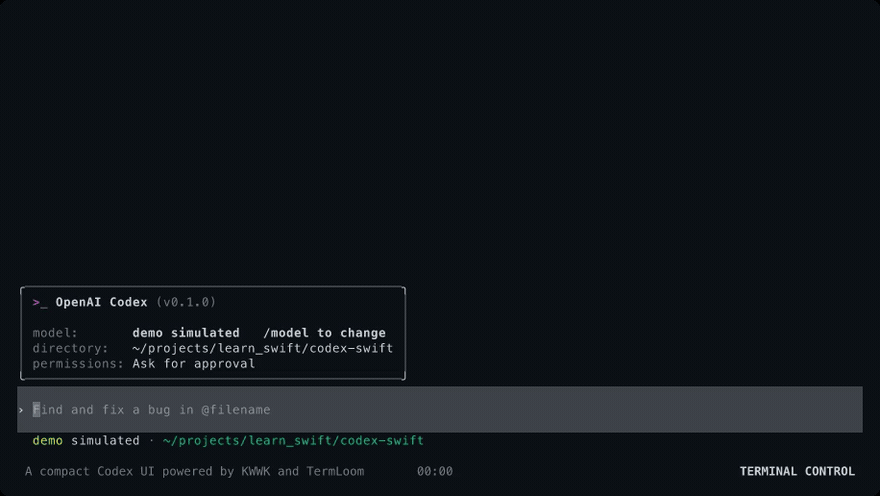

# Codex Swift

An idiomatic Swift implementation of the OpenAI Codex terminal experience and a production pressure client for
[TermLoom](https://github.com/Frank-III/termloom).

- UX and behavioral reference: [OpenAI Codex](https://github.com/openai/codex) at
  `e428a12d2235fe2bc10b10bc45d245d1f491f3c7`
- Underlying agent and tool runtime: [KWWK](https://github.com/EYHN/kwwk) `0.1.36`
  (`e8535dd0b417213941ee4003f9c9ecb1f18523ba`)
- Terminal framework: [TermLoom](https://github.com/Frank-III/termloom)

This is not a source translation and is not affiliated with or endorsed by OpenAI. Codex's interaction states and
visual behavior are modeled as Swift values, KWWK owns model and tool execution, and TermLoom owns terminal correctness.
The application exists both as a compact usable agent UI and as a realistic test of TermLoom's inline history,
streaming, editing, overlays, syntax highlighting, and resize behavior.



_Recorded from the deterministic `codex-swift --demo` runtime with
[Terminal Control](https://github.com/anomalyco/terminal-control); no provider credentials or network access are used._

```sh
mise run test
mise run demo
mise exec -- swift run codex-swift
mise exec -- swift run -c release codex-swift --large-demo 1000
mise exec -- swift run -c release codex-swift --large-live 1000
mise exec -- swift run -c release codex-benchmark --turns 1000 --iterations 100
```

The live executable reads every usable API-key and supported OAuth credential from
`~/.pi/agent/auth.json`, merges authenticated provider models from pi's
`~/.pi/agent/models-store.json` and KWWK's catalog, and honors pi's provider/model/reasoning defaults
from `~/.pi/agent/settings.json`. Credentials remain in pi's file; OAuth refresh state is held in
memory. Supported provider environment variables are merged into the same catalog.

The application follows Codex's two-part normal-buffer design: a retained 22-row live viewport owns
the mutable stream/composer, while each newline-stable Markdown prefix and finalized transcript cell
is inserted immediately above it through TermLoom's inline scrolling-region algorithm. Those committed
rows fill the rest of a tall terminal and then continue into native terminal scrollback instead of
being clipped from an oversized frame. Standard hosts use Codex Rust's bottom-margin CRLF strategy;
Supaterm, Zellij, and tmux use TermLoom's conservative whole-terminal output/repaint path because those
hosts can discard every row moved out through a restricted scrolling margin. The source model remains complete for Ctrl-T/PageUp navigation
and width-change reflow. Inline origin reservation follows Ratatui Rust's probe-before-append algorithm
and falls back to a known absolute bottom anchor when CPR is unavailable. Mouse tracking stays
disabled for native selection and copy. Width changes purge stale terminal-reflowed rows, reanchor at
column zero, and replay committed history from canonical source at the new width.

KWWK command and file-mutation tool calls pass through an asynchronous approval coordinator before
execution. The bottom pane follows Codex's numbered approval surface, supports direct shortcuts,
queues concurrent requests, honors cancellation, and can remember an exact command or file path for
the current session. Read-only tools continue without prompting.

The agent also receives a native `request_user_input` tool. Option lists, freeform answers, notes,
multi-question navigation, structured answers, and interruption all stay inside the inline Codex
bottom pane while the tool awaits the user asynchronously.

`/model` follows Codex's model-then-effort flow across all authenticated pi/KWWK providers, shows
provider tags, supports type-to-filter search over provider/id/name, and only offers reasoning levels
supported by the live KWWK model capability map. `/permissions` changes the real approval gate between Ask for
approval and Full Access; Full Access always requires Codex's second explicit warning screen.
`/personality` applies Codex's Friendly or Pragmatic communication instruction to the live agent
system prompt for subsequent turns.

`/theme` follows Codex's searchable syntax-theme picker with live preview, Escape restoration, and
confirm-time persistence in `~/.codex-swift/settings.json`. It exposes the same 32 built-in theme
names and loads custom `.tmTheme` files from `~/.codex-swift/themes`. Fenced code, shell commands,
file-extension-aware diffs, and the source-shaped Rust diff preview all use TermLoom Swift's reusable
pure-Swift 192-language highlighting module rather than app-specific token rules. `/raw [on|off]`
and Option-R toggle Codex's copy-friendly transcript rendering and persist the choice in the same
settings file.

`/keymap` provides a searchable, live single-key remapper for the thirteen shortcuts currently wired
through Codex Swift's global, chat, and composer dispatch, including upstream's Control-O copy action
and configurable Vim-mode toggle. Control-G restores the terminal, opens `$VISUAL` or `$EDITOR`
with the expanded Markdown draft, trims trailing whitespace, and resumes the retained TUI without
losing images or active-task state. Control-L purges terminal scrollback and the visible transcript
while idle, and is source-consistently blocked during active tasks. Control-T opens a full-height
transcript pager whose live tail
tracks streaming responses and tool updates while pinned to the bottom, preserves manual scroll
position when the user navigates upward, and supports row, page, half-page, top, and bottom movement.
With an empty idle composer, Escape primes backtrack, a second Escape opens the transcript with the
latest user turn highlighted, Escape/Left and Right traverse prior turns, and Enter invokes KWWK's
real rewind operation and restores the selected text and images for editing. Its source-shaped tabs cover All, Common,
Customized, Unbound, App, Composer, and Debug groups; `/keymap debug` and the Debug tab open a live
keypress inspector that reports the terminal event, canonical config key, assigned action, and
Default or Custom source while reserving Control-C exclusively for close. Editing supports
replacement, alternate bindings, custom-binding reset, conflict rejection, immediate activation,
and atomic persistence in `settings.json` without replacing theme, raw-output, unknown top-level, or
deferred-context values. Editor, Vim, pager, list, and approval action catalogs remain deferred
rather than appearing as nonfunctional controls.

Live KWWK tool events update running command output in place and preserve command/path context through
completion. Successful edits render unified diff cells; failed edits retain the target path and show
bounded failure output instead of a misleading empty “Edited” cell. KWWK's standard public toolset
currently exposes single-file `edit`; Codex Swift does not fake upstream's native multi-file
`apply_patch` protocol inside the TUI.

Streaming assistant Markdown uses a source-backed, newline-gated controller modeled directly on
upstream Codex's `markdown_stream.rs`, `streaming/controller.rs`, and
`streaming/table_holdback.rs`. Incomplete source lines remain pending; completed prose becomes a
stable prefix; candidate and confirmed pipe tables remain a mutable tail until finalization; and the
final transcript is canonicalized from the provider's complete source. The scanner handles quoted
tables, Markdown and non-Markdown fences, arbitrary Unicode/chunk boundaries, provider prefix
rewrites, stream rewind, and final lines without a trailing newline.

The standard composer supports macOS and shell editing conventions: Option/Control arrows move by
word, Option-Backspace and Control-W delete the previous word, Option-D deletes the next word,
Control-U/Control-K kill to the line boundary, Control-A/Control-E move to line boundaries,
Control-B/Control-F move by character, and Shift-Enter inserts a newline. Long and multiline drafts
expand and word-wrap like upstream instead of being clipped to a single composer row.

`/vim` enables modal composer editing. It starts in Normal mode, shows `Vim: Normal` or
`Vim: Insert` in the footer, handles Escape as the Insert-to-Normal transition, supports common
motions and edit operators, and returns to Normal mode after a successful submission.
TermLoom Swift drives the terminal's native steady-bar Insert cursor and restores the user's default
cursor shape in Normal mode and when the terminal session exits.

Conversations persist under `~/.codex-swift/sessions` through KWWK's append-only JSONL store.
`/resume`, `/fork`, `/rename`, `/archive`, `/delete`, and `/new` rotate the complete session-scoped
agent runtime, while Ctrl-R searches prompt history without losing the current draft.

`/review` drives source-shaped review presets, `/plan` changes the live agent contract, `/diff`
includes tracked and untracked files without invoking repository diff helpers, `/copy` writes the
last Markdown answer to the macOS clipboard, and `/compact` uses KWWK's real compaction pipeline.
`/goal <objective>` installs KWWK's verified-completion goal tool and runs guarded autonomous
continuations until completion, pause, interruption, or the continuation cap.

`/side` and `/btw` create an ephemeral KWWK fork with Codex's inherited-history boundary. The main
turn can continue in the background: Ctrl-/ switches between the preserved parent and side runtimes,
while Ctrl-C closes the side. Approvals and questions remain attached to the thread that requested
them. `/agent` exposes the main thread and KWWK subagent history, `/ps` and `/stop` manage background
terminals, and `/usage` reports live transcript usage.

`/skills` inserts a KWWK-discovered `$skill` mention from an inline picker. The host uses KWWK's
public `Skills.load` over the same
directories supplied to `CodingAgentConfig`, so KWWK remains an untouched dependency and there is
only one discovery implementation. `/thinking`, `/verbose`, `/context`, `/queue`, and `/tools`
operate directly on the live KWWK agent; `/init`, `/hotkeys`, and `/help` expose those workflows in
the Codex shell.

`/mention` and typing `@` open a git-aware project file picker that excludes ignored files. Large
pastes use Codex's compact `[Pasted Content N chars]` composer element and expand to the exact
original text before KWWK submission. Option-Up uses KWWK's native steering-queue rotation to pull
the latest queued prompt back into the composer without maintaining a parallel queue algorithm.
Pasting a PNG, JPEG, GIF, or WebP path—or pressing Control-V with a macOS clipboard image—adds a
Codex-style image row to the composer. Backspace removes the last image when the text field is
empty. Submission, steering, and follow-up queues encode the bytes through KWWK's native
`ImageContent`; models without image input support reject the attachment in the UI. Local files,
clipboard images, pasted HTTP(S) URLs, and base64 image data URLs are normalized through KWWK's
image pipeline before they reach the composer.

See [Architecture](Documentation/Architecture.md), [Parity](Documentation/Parity.md), and
[large-session performance](Documentation/Performance.md).
